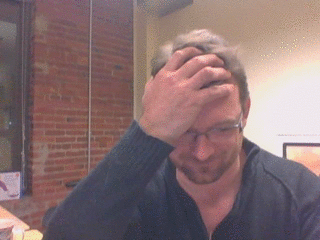

camtrap - catch jokers on video
===============================

Some people just can't resist the temptation to prank an unlocked
keyboard.  This locks your screen with a transparent window that will
play an alarm and snap a video if anyone touches it.  Quit by pressing
Control or Alt.

Installation
------------

Requires Python, PyQt4, and cv2.

I make a keyboard shortcut to locktrap_ which disables the current
screen saver, starts camtrap, then locks the screen when camtrap
exits.

.. _locktrap: locktrap

Check out memeify_ to convert an avi to an animated gif::

  ./memeify noel.gif "Dude..."  "Hands Off!" caught/20151215-172204.617244.avi

.. _memeify: memeify

Author
------
2015-12-16 Noel Burton-Krahn <noel@burton-krahn.com>

